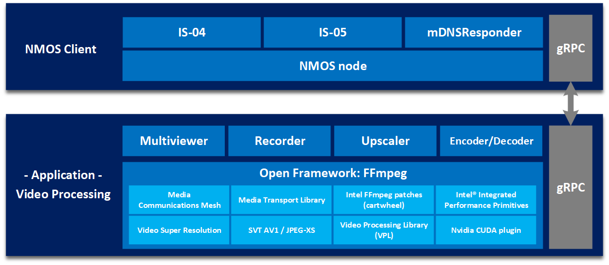

# Intel® Tiber™ Broadcast Suite

## 1. Overview

The Intel® Video Production Pipeline is a software-based package designed for creation of high-performance and high-quality solutions used in live video production.
The video pipelines are built using Intel-optimized version of FFmpeg and combine: media transport protocols (SMPTE ST 2110-compliant), JPEG-XS encoding/decoding, GPU media processing and rendering.

## 2. Intel® Tiber™ Broadcast Suite



### 2.1 High level components description:

The Intel® Video Production Pipeline uses open-source FFmpeg framework as a baseline, and enhances it with:
- Intel® Media Transport Library (MTL) with SMPTE 2110 transport protocols and yuv422p10le and y210le pixel formats.
- Intel® QSV and OneVPL libraries to support hardware-accelerated media processing with Intel Flex GPU cards.
- DPC++ kernels to enable custom effect filters used in video production (not supported in this release).
- OpenGL/Vulcan integration to display rendering effects (not supported in this release).

The software package includes several performance features on to of regular Intel® FFMpeg-Cartwheel releases:
- memory management optimizations for page-aligned surface allocations
- asynchronous execution of video pipeline filters to maximize GPU utilization
- high-throughput GPU-CPU memory data transfers


### 2.2 Intel®'s Media Transport Library (MTL) for Intel® Tiber™ Broadcast Suite:

- **Lockless Design:** MTL employs a lockless design in the data plane, utilizing busy polling (busy-waiting or spinning) to achieve ultra-high performance and low latency. This technique constantly checks for new data packets, minimizing latency and avoiding costly context switches between the kernel and user space.
- **Tasklet Scheduler:** MTL incorporates an asynchronous tasklet scheduler, allowing efficient utilization of the pinned polling thread. Tasklets are lightweight functions that run in the context of the pinned thread, enabling more efficient use of the Last Level Cache (LLC) at different processing stages.
- **Session Migration:** MTL supports session migration with the ability to redistribute overloaded sessions to underutilized schedulers at runtime, adding flexibility to deployment and accommodating unpredictable system capacity.
- **Zero-Copy Packet Build:** MTL leverages the multi-buffer descriptor feature of modern NICs to achieve zero-copy transmission when using DPDK Poll Mode Drivers (PMDs), delivering unparalleled performance with a single core capable of sending approximately 50 Gbps.
- **ST2110-21 Pacing:** MTL addresses the stringent timing requirements of ST2110-21 through a software-based approach, combining NIC rate-limiting features with a software algorithm, successfully passing numerous third-party interoperability verifications.
- **Huge Page Memory Management:** MTL utilizes hugepages for performance optimization, reducing TLB misses, improving cache usage, and avoiding page faults, thereby enhancing packet processing efficiency.
- **Comprehensive Control Protocols:** MTL implements specific control protocols, including `ARP`, `IGMP`, `DHCP`, and `PTP`, to support the `DPDK Poll Mode Driver's` nature of bypassing the kernel.
- **Flexible API and Ecosystem:** MTL offers a comprehensive API and ecosystem, including frame mode, slice mode, RTP passthrough mode, pipeline mode, and support for `ST2022-6`, `ST2110-22` `JPEG XS`, `redundancy`, `interlaced video`, and more, enabling seamless integration with popular media frameworks like FFMPEG, OBS, and Intel® Media SDK.
- **Runtime Configuration:** MTL allows runtime updates to source and destination addresses, enabling dynamic reconfiguration without the need for session recreation, providing significant flexibility in switch/forward scenarios.
- **Timing Parser and Analysis:** MTL provides utilities for verifying the compliance of incoming ST2110-20 RX streams with the ST2110 standard, including a built-in status report, detailed parsing results, and a sample timing parser UI constructed using Python bindings.

### 2.3 Intel® Library for Video Super Resolution (RAISR) for Intel® Tiber™ Broadcast Suite:

Intel's Library for Video Super Resolution stands out as a high-performance, highly customizable, and efficient solution for video upscaling and sharpening, leveraging Intel's cutting-edge hardware and software technologies, while offering seamless integration with industry-standard tools and fostering an open-source community.


- **Rapid and Accurate Image Super Resolution:** Intel's Library for Video Super Resolution (Intel Library for VSR) is a cutting-edge solution that leverages the RAISR (Rapid and Accurate Image Super Resolution) algorithm, a public AI-based algorithm known for its superior quality and efficient performance-quality trade-off compared to other deep learning-based algorithms like EDSR.
- **Intel® Advanced Vector Extension 512:** Intel has enhanced the RAISR algorithm to achieve better visual quality and beyond real-time performance for 2x and 1.5x upscaling on Intel Xeon platforms and Intel GPUs, taking advantage of Intel Advanced Vector Extension 512 (Intel AVX-512) and the newly added Intel AVX-512FP16 support on Intel Xeon 4th Generation (Sapphire Rapids) processors.
- **C++ Optimal Performance:** The Intel Library for VSR is provided as an FFmpeg plugin inside a Docker container (CPU only), simplifying testing and deployment efforts, and is developed using C++ for optimal performance.
- **Advanced customization options:** The library offers advanced customization options, including thread count adjustment, filter folder selection for different training parameters and datasets, bit depth support (8-bit and 10-bit), color range control, blending modes, multi-pass processing, and assembly instruction set selection (AVX-512FP16, AVX-512, AVX2, or OpenCL).
- **Census Transform (CT) and Difference of Gaussians (DoG):** Intel's implementation of the RAISR algorithm includes a novel, highly efficient, and effective sharpening algorithm based on the Census Transform (CT) and Difference of Gaussians (DoG) filters, capable of enhancing a wide range of frequencies while avoiding common sharpening artifacts like halos and noise amplification.
- **Intel GPUs through OpenCL:** The Intel Library for VSR supports hardware acceleration on Intel GPUs through OpenCL, as well as integration with FFmpeg-QSV and FFmpeg-VAAPI for efficient video processing pipelines.
- **BSD 3-Clause:** Intel's commitment to open-source and community contributions is evident, as the project is hosted on GitHub, and contributions are welcomed under the BSD 3-Clause "New" or "Revised" license.

## 3. Build Instructions

### 3.1 Quick Start

### 3.1.1 Fetch repository from source

```bash
git clone <REPOSITORY-URL> intel-tiber-broadcast-suite
```

### 3.1.2 Build docker image

```bash
cd intel-tiber-broadcast-suite
./build.sh
```

### 3.1.3 Run docker image

```bash
docker run -it --entrypoint=/bin/bash --privileged video_production_image
ffmpeg --help
```

### 3.2 Build Guide

To build please refer to the [build guide](build.md)

## 4. High level usage examples

How to run and example usage of the Intel® Tiber™ Broadcast Suite [run guide](run.md)
