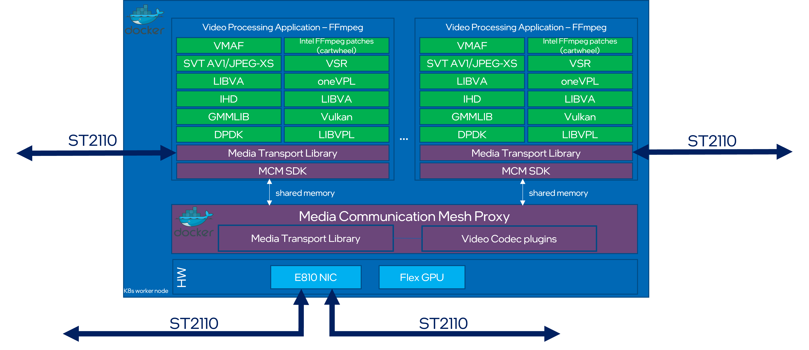

# Intel® Tiber™ Broadcast Suite

## 1. Overview

The Intel® Video Production Pipeline is a software-based package designed for creation of high-performance and high-quality solutions used in live video production.
The video pipelines are built using Intel-optimized version of FFmpeg and combine: media transport protocols (SMPTE ST 2110-compliant), JPEG-XS encoding/decoding, GPU media processing and rendering.

The diagram below illustrates an example pipeline created with this software package:


## 2. Intel® Tiber™ Broadcast Suite High level description

The Intel® Video Production Pipeline uses open-source FFmpeg framework as a baseline, and enhances it with:
- Intel® Media Transport Library (MTL) with SMPTE 2110 transport protocols and yuv422p10le and y210le pixel formats.
- Intel® QSV and OneVPL libraries to support hardware-accelerated media processing with Intel Flex GPU cards.
- DPC++ kernels to enable custom effect filters used in video production (not supported in this release).
- OpenGL/Vulcan integration to display rendering effects (not supported in this release).

The software package includes several performance features on to of regular Intel® FFMpeg-Cartwheel releases:
- memory management optimizations for page-aligned surface allocations
- asynchronous execution of video pipeline filters to maximize GPU utilization
- high-throughput GPU-CPU memory data transfers



## 3. Build Instructions

### 3.1 Quick Start

### 3.1.1 Fetch repository from source

```bash
git clone <REPOSITORY-URL> intel-tiber-broadcast-suite
```

### 3.1.2 Build docker image

```bash
cd intel-tiber-broadcast-suite
./build.sh
```

### 3.1.3 Run docker image

```bash
docker run -it --entrypoint=/bin/bash --privileged video_production_image
ffmpeg --help
```

### 3.2 Build Guide

To build please refer to the [build guide](build.md)

## 4. High level usage examples

How to run and example usage of the Intel® Tiber™ Broadcast Suite [run guide](run.md)
