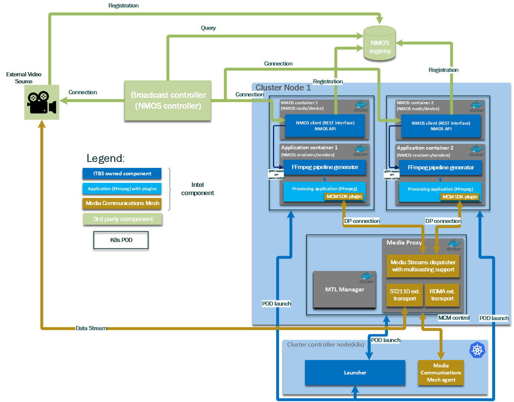

# Architecture

## 1. Overview
The Intel® Tiber™ Broadcast Suite is a software-based package designed for creation of high-performance and high-quality solutions used in live video production. The video pipelines are built using Intel-optimized version of FFmpeg and combine: media transport protocols (SMPTE ST 2110-compliant), JPEG XS encoding/decoding, GPU media processing and rendering.

## 2. Software Architecture

The Intel® Tiber™ Broadcast Suite uses open-source FFmpeg framework as a baseline, and enhances it with:
- Media Transport Library (MTL) with SMPTE 2110 transport protocols and yuv422p10le and y210le pixel formats.
- Intel® QSV and OneVPL libraries to support hardware-accelerated media processing with Intel Flex GPU cards.
- DPC++ kernels to enable custom effect filters used in video production (not supported in this release).
- OpenGL/Vulkan integration to display rendering effects (not supported in this release).

The software package includes several performance features on top of regular [Intel's Cartwheel FFmpeg](https://github.com/intel/cartwheel-ffmpeg/) upstream patches:
- memory management optimizations for page-aligned surface allocations
- asynchronous execution of video pipeline filters to maximize GPU utilization
- high-throughput GPU-CPU memory data transfers

## 3. Components inside Suite's docker image

Component               |   Version     |   Source
---                     |   ---         |   ---
FFmpeg                  |   7.0.2       |   [FFmpeg ](https://github.com/FFmpeg/FFmpeg)
Intel® FFmpeg patches   |   7.0         |   [Intel® FFmpeg patches](https://github.com/intel/cartwheel-ffmpeg)
Media Transport Library |   v25.02       |   [Media Transport Library](https://github.com/OpenVisualCloud/Media-Transport-Library)
Media Communications Mesh|   24.09      |   [Media Communications Mesh](https://github.com/OpenVisualCloud/Media-Communications-Mesh)
Data Plane Development Kit (DPDK)   |    23.11   |   [DPDK](https://github.com/DPDK/dpdk)
SVT JPEG XS             |  0.9      |   [SVT JPEG XS](https://github.com/OpenVisualCloud/SVT-JPEG-XS)
SVT AV1                 |  1.7.0        |   [SVT AV1](https://gitlab.com/AOMediaCodec/SVT-AV1)
Intel® Integrated Performance Primitives    |  2021.10.1.16    |	[IPP](https://www.intel.com/content/www/us/en/developer/articles/tool/oneapi-standalone-components.html#ipp)
Video Super Resolution  |   23.11       |   [VSR](https://github.com/OpenVisualCloud/Video-Super-Resolution-Library)
VMAF                    |   2.3.1       |   [VMAF](https://github.com/Netflix/vmaf)
oneVPL                  |   24.4.4      |   [oneVPL](https://github.com/intel/vpl-gpu-rt)
LIBVPL                  |   2.13.0    |   [LIBVPL](https://github.com/intel/libvpl)
Intel Media Driver (IHD)|   24.4.4      |   [IHD](https://github.com/intel/media-driver)
GMMLIB                  |   22.5.5     |   [GMMLIB](https://github.com/intel/gmmlib)
Vulkan-Headers          |   1.3.280.0   |   [Vulkan](https://github.com/KhronosGroup/Vulkan-Headers)
LIBVA                   |   2.22.0      |   [LIBVA](https://github.com/intel/libva)
Nvidia CUDA plugin      |   [version](https://github.com/FFmpeg/nv-codec-headers/tree/1889e62e2d35ff7aa9baca2bceb14f053785e6f1)  |   [Nvidia CUDA plugin](https://github.com/FFmpeg/nv-codec-headers)
