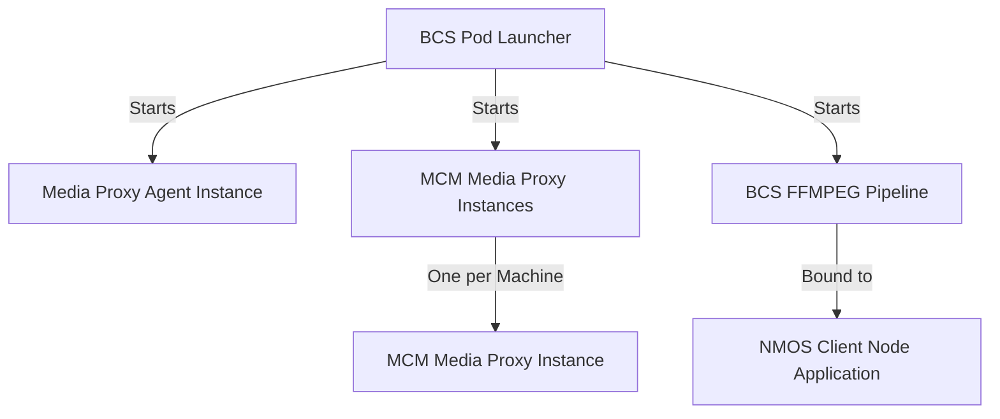

# Build guide

To successfully build the Intel® Tiber™ Broadcast Suite, you need to follow a series of steps involving BIOS configuration, driver installation, host machine setup, and package installation. Depending on your preference, you can install the suite as a Docker application (the recommended method) or directly on a bare metal machine.

## Table of contents

- [Build guide](#build-guide)
      - [Table of contents](#table-of-contents)
  - [1. Prerequisites](#1-prerequisites)
    - [1.1. BIOS Settings](#11-bios-settings)
    - [1.2. Install Docker](#12-install-docker)
      - [1.2.1. Install Docker Build Environment](#121-install-docker-build-environment)
      - [1.2.2. Setup Docker Proxy](#122-setup-docker-proxy)
    - [1.3. Install GPU Driver](#13-install-gpu-driver)
      - [1.3.1. Intel Flex GPU Driver](#131-intel-flex-gpu-driver)
      - [1.3.2. Nvidia GPU Driver](#132-nvidia-gpu-driver)
    - [1.4. Install and Configure Host's NIC Drivers and Related Software](#14-install-and-configure-hosts-nic-drivers-and-related-software)
    - [1.5. Configure VFIO (IOMMU) required by PMD-based DPDK](#15-configure-vfio-iommu-required-by-pmd-based-dpdk)
    - [1.6. (Optional) Configure PTP)](#16-optional-configure-ptp)
  - [2. Install Intel® Tiber™ Broadcast Suite](#2-install-intel®-tiber™-broadcast-suite)
    - [Option #1: Build Docker Image from Dockerfile Using build.sh Script](#option-1-build-docker-image-from-dockerfile-using-buildsh-script)
    - [Option #2: Local Installation from Debian Packages](#option-2-local-installation-from-debian-packages)
    - [Option #3: Install Docker Image from Docker Hub](#option-3-install-docker-image-from-docker-hub)
    - [Option #4: Build Docker Image from Dockerfile Manually](#option-4-build-docker-image-from-dockerfile-manually)
  - [3. (Optional) Install Media Proxy](#3-optional-install-media-proxy)
    - [Option #1: (Recommended) Dockerized Installation](#option-1-recommended-dockerized-installation)
    - [Option #2: Local Installation](#option-2-local-installation)
  - [4. Preparation to Run Intel® Tiber™ Broadcast Suite](#4-preparation-to-run-intel®-tiber™-broadcast-suite)
    - [4.1  Use BCS Launcher app](#41-use-bcs-launcher-app)
    - [4.2. First Run Script](#42-first-run-script)
    - [4.3. Test Docker Installation](#43-test-docker-installation)
    - [4.4. Test Local Installation](#44-test-local-installation)
  - [5. Running the Image](#5-running-the-image)
      

## 1. Prerequisites

Steps to perform before running Intel® Tiber™ Broadcast Suite on a host with Ubuntu operating system installed.

### 1.1. BIOS Settings

> **Note:** It is recommended to properly set up BIOS settings before proceeding. Depending on the manufacturer, labels may vary. Please consult an instruction manual or ask a platform vendor for detailed steps.

The following technologies must be enabled for Media Transport Library (MTL) to function properly:
- [Intel® Virtualization for Directed I/O (VT-d)](https://en.wikipedia.org/wiki/X86_virtualization#Intel_virtualization_(VT-x))
- [Single-root input/output virtualization (SR-IOV)](https://en.wikipedia.org/wiki/Single-root_input/output_virtualization)
- For 200 GbE throughput on [Intel® Ethernet Network Adapter E810-2CQDA2 card](https://ark.intel.com/content/www/us/en/ark/products/210969/intel-ethernet-network-adapter-e810-2cqda2.html), a PCI-E lane bifurcation is required.

### 1.2. Install Docker

> **Note:** This step is optional if you want to install Intel® Tiber™ Broadcast Suite locally.

#### 1.2.1. Install Docker Build Environment

To install the Docker environment, please refer to the official Docker Engine on Ubuntu installation manual's [Install using the apt repository](https://docs.docker.com/engine/install/ubuntu/#install-using-the-repository) section.

> **Note:** Do not skip `docker-buildx-plugin` installation, otherwise the `build.sh` script may not run properly.

#### 1.2.2. Setup Docker Proxy

Depending on the network environment, it could be required to set up the proxy. In that case, please refer to [Configure the Docker client](https://docs.docker.com/network/proxy/#configure-the-docker-client) section of _Configure Docker to use a proxy server_ guide.

### 1.3. Install GPU Driver

#### 1.3.1. Intel Flex GPU Driver

To install the Flex GPU driver, follow the [1.4.3. Ubuntu Install Steps](https://dgpu-docs.intel.com/driver/installation.html#ubuntu-install-steps) part of the Installation guide for Intel® Data Center GPUs.

> **Note:** If prompted with `Unable to locate package`, please ensure the repository key `intel-graphics.key` is properly dearmored and installed as `/usr/share/keyrings/intel-graphics.gpg`.

Use the `vainfo` command to check the GPU installation:

```bash
sudo vainfo
```

#### 1.3.2. Nvidia GPU Driver

In case of using an Nvidia GPU, please follow the steps below:
```bash
sudo apt install --install-suggests nvidia-driver-550-server
sudo apt install nvidia-utils-550-server
```

In case of any issues please follow [Nvidia GPU driver install steps](https://ubuntu.com/server/docs/nvidia-drivers-installation#heading--manual-driver-installation-using-apt).

> **Note:** Supported version of Nvidia driver compatible with packages inside Docker container is
>* **Driver Version: 550.90.07**
>* **CUDA Version: 12.4**

### 1.4. Install and Configure Host's NIC Drivers and Related Software

1. If you didn't do it already, then download the project from the GitHub repo.
    ```bash
    git clone --recurse-submodules https://github.com/OpenVisualCloud/Intel-Tiber-Broadcast-Suite
    cd Intel-Tiber-Broadcast-Suite
    ```

1. Install patched ice driver for Intel® E810 Series Ethernet Adapter NICs.

   1. Download the ice driver.
       ```bash
       mkdir -p ${HOME}/ice_patched
       . versions.env && wget -qO- $LINK_ICE_DRIVER | tar -xz -C ${HOME}/ice_patched
       ```

   1. Patch the ice driver.
       ```bash
        # Ensure the target directory exists
        mkdir -p ${HOME}/Media-Transport-Library
       ```
       ```bash
       # Download Media Transport Library:
       . versions.env && curl -Lf https://github.com/OpenVisualCloud/Media-Transport-Library/archive/refs/tags/${MTL_VER}.tar.gz | tar -zx --strip-components=1 -C ${HOME}/Media-Transport-Library
       ```
       ```bash
       . versions.env && git -C ${HOME}/ice_patched/ice-* apply ~/Media-Transport-Library/patches/ice_drv/${ICE_VER}/*.patch

       cd ${HOME}/ice_patched/ice-*
       ```

   1. <!-- [ --> Install the ice driver. <!-- ](../submodules/Media-Communications-Mesh/submodules/Media-Transport-Library/doc/chunks/_build_install_ice_driver.md) -->
       
       <!-- TBD after having submodule with MTL
       ```{include} ../submodules/Media-Communications-Mesh/submodules/Media-Transport-Library/doc/chunks/_build_install_ice_driver.md
       ``` 
       -->
       ```bash
       cd src
       make
       sudo make install
       # sudo rmmod irdma 2>/dev/null
       sudo rmmod ice
       sudo modprobe ice
       cd -
       ```
       <!-- TBD up to here removed after having submodule with MTL and including this part of file -->

   1. Check if the driver is installed properly, and if so - clean up.
        ```bash
        # should give you output
        sudo dmesg | grep "Intel(R) Ethernet Connection E800 Series Linux Driver - version Kahawai"
        ```
        ```bash
        rm -rf ${HOME}/ice_patched ${HOME}/Media-Transport-Library
        ```

   1. Update firmware.
        ```bash
        . versions.env && wget ${LINK_ICE_FIRMWARE}
        unzip Release_*.zip
        cd NVMUpdatePackage/E810
        tar xvf E810_NVMUpdatePackage_v*_Linux.tar.gz
        cd E810/Linux_x64/
        sudo ./nvmupdate64e
        ```

    1. Verify installation.
        ```bash
        # replace with your device
        ethtool -i ens801f0
        ```
        Result should look like:
        ```text
        driver: ice
        version: Kahawai_1.14.9_20240613
        firmware-version: 4.60 0x8001e8dc 1.3682.0
        ```

    > **Note:** if you encountered any problems, please go to [E810 driver guide](https://github.com/OpenVisualCloud/Media-Transport-Library/blob/v25.02/doc/e810.md).


### 1.5. <!-- [ --> Configure VFIO (IOMMU) required by PMD-based DPDK <!-- ](../submodules/Media-Communications-Mesh/submodules/Media-Transport-Library/doc/chunks/_iommu_setup.md) -->
<!-- TBD after having submodule with MTL
```{include} ../submodules/Media-Communications-Mesh/submodules/Media-Transport-Library/doc/chunks/_iommu_setup.md
```
-->
If you have already enabled IOMMU, you can skip this step. To check if IOMMU is enabled, please verify if there are any IOMMU groups listed under the `/sys/kernel/iommu_groups/` directory. If no groups are found, it indicates that IOMMU is not enabled.

```bash
ls -l /sys/kernel/iommu_groups/
```

#### Enable IOMMU(VT-D and VT-X) in BIOS

The steps to enable IOMMU in your BIOS/UEFI may vary depending on the manufacturer and model of your motherboard. Here are general steps that should guide you:

1. Restart your computer. During the boot process, you'll need to press a specific key to enter the BIOS/UEFI setup. This key varies depending on your system's manufacturer. It's often one of the function keys (like F2, F10, F12), the ESC key, or the DEL key.

2. Navigate to the advanced settings. Once you're in the BIOS/UEFI setup menu, look for a section with a name like "Advanced", "Advanced Options", or "Advanced Settings".

3. Look for IOMMU setting. Within the advanced settings, look for an option related to IOMMU. It might be listed under CPU Configuration or Chipset Configuration, depending on your system. For Intel systems, it's typically labeled as "VT-d" (Virtualization Technology for Directed I/O). Once you've located the appropriate option, change the setting to "Enabled".

4. Save your changes and exit. There will typically be an option to "Save & Exit" or "Save Changes and Reset". Select this to save your changes and restart the computer.

#### Enable IOMMU in Kernel

After enabling IOMMU in the BIOS, you need to enable it in your operating system as well.

##### Ubuntu/Debian

Edit `GRUB_CMDLINE_LINUX_DEFAULT` item in `/etc/default/grub` file, append below parameters into `GRUB_CMDLINE_LINUX_DEFAULT` item if it's not there.

```bash
sudo vim /etc/default/grub
```
```text
intel_iommu=on iommu=pt
```

then:

```bash
sudo update-grub
sudo reboot
```

##### CentOS/RHEL9

```bash
sudo grubby --update-kernel=ALL --args="intel_iommu=on iommu=pt"
sudo reboot
```

For non-Intel devices, contact the vendor for how to enable IOMMU.

#### Double Check iommu_groups Creation by Kernel After Reboot

```bash
ls -l /sys/kernel/iommu_groups/
```

If no IOMMU groups are found under the `/sys/kernel/iommu_groups/` directory, it is likely that the previous two steps were not completed as expected. You can use the following two commands to identify which part was missed:

```bash
# Check if "intel_iommu=on iommu=pt" is included
cat /proc/cmdline
# Check if CPU flags have vmx feature
lscpu | grep vmx
```

#### Unlock RLIMIT_MEMLOCK for non-root Run

Skip this step for Ubuntu since the default RLIMIT_MEMLOCK is set to unlimited already.

Some operating systems, including CentOS Stream and RHEL 9, have a small limit to RLIMIT_MEMLOCK (amount of pinned pages the process is allowed to have) which will cause DMA remapping to fail during the running. Please edit `/etc/security/limits.conf`, append below two lines at the end of the file, change <USER> to the username currently logged in.

```text
<USER>    hard   memlock           unlimited
<USER>    soft   memlock           unlimited
```

Reboot the system to let the settings take effect.

<!-- TBD up to here removed after having submodule with MTL and including this part of file -->

### 1.6. <!-- [ --> (Optional) Configure PTP <!-- ](../submodules/Media-Communications-Mesh/submodules/Media-Transport-Library/doc/chunks/_ptp_setup.md) -->
<!-- TBD after having submodule with MTL
```{include} ../submodules/Media-Communications-Mesh/submodules/Media-Transport-Library/doc/chunks/_ptp_setup.md
```
-->
The Precision Time Protocol (PTP) facilitates global timing accuracy in the microsecond range for all essences.
Typically, a PTP grandmaster is deployed within the network, and clients synchronize with it using tools like ptp4l.
This library includes its own PTP implementation, and a sample application offers the option to enable it.
Please refer to section [Built-in PTP](#built-in-ptp) for instructions on how to enable it.

By default, the built-in PTP feature is disabled, and the PTP clock relies on the system time source of the user application (clock_gettime). However, if the built-in PTP is enabled, the internal NIC time will be selected as the PTP source.

#### Linux ptp4l Setup to Sync System Time with Grandmaster

Firstly run ptp4l to sync the PHC time with grandmaster, customize the interface as your setup.

```bash
sudo ptp4l -i ens801f2 -m -s -H
```

Then run phc2sys to sync the PHC time to system time, please make sure NTP service is disabled as it has conflict with phc2sys.

```bash
sudo phc2sys -s ens801f2 -m -w
```

#### Built-in PTP

This project includes built-in support for the Precision Time Protocol (PTP) protocol, which is also based on the hardware Network Interface Card (NIC) timesync feature. This combination allows for achieving a PTP time clock source with an accuracy of approximately 30ns.

To enable this feature in the RxTxApp sample application, use the `--ptp` argument. The control for the built-in PTP feature is the `MTL_FLAG_PTP_ENABLE` flag in the `mtl_init_params` structure.

Note: Currently, the VF (Virtual Function) does not support the hardware timesync feature. Therefore, for VF deployment, the timestamp of the transmitted (TX) and received (RX) packets is read from the CPU TSC (TimeStamp Counter) instead. In this case, it is not possible to obtain a stable delta in the PTP adjustment, and the maximum accuracy achieved will be up to 1us.
<!-- TBD up to here removed after having submodule with MTL and including this part of file -->

## 2. Install Intel® Tiber™ Broadcast Suite

### Option #1: Build Docker Image from Dockerfile Using build.sh Script
> **Note:** This method is recommended instead of Option #2 - layers are built in parallel, cross-compatibility is possible.

1. Access the project directory.

```bash
cd Intel-Tiber-Broadcast-Suite
```

2. Install Dependencies.

```bash
sudo apt-get update
sudo apt-get install meson python3-pyelftools libnuma-dev
```

3. Run build.sh script.

> **Note:** For `build.sh` script to run without errors, `docker-buildx-plugin` must be installed. The error thrown without the plugin does not inform about that fact, rather that the flags are not correct. See section [1.2.1. Install Docker build environment](#121-install-docker-build-environment) for installation details.

```bash
./build.sh
```

### Option #2: Local Installation of The Applications from Sources

1. Navigate to the source directory of the project to begin the local installation process.

```bash
cd <project_dir>/src
```

2. Run build_local.sh script.

```bash
./build_local.sh
```
This script is used to build the project with optional configurations. It accepts the following parameters:

#### Parameters:
- `-ut`: Enables building with unit tests. Use this option if you want to include unit tests in the build process.
- `--build_type <type>`: Specifies the build type. Replace `<type>` with the desired build configuration, such as "Debug" or "Release". This allows you to control the optimization and debugging settings of the build.
- `-h, --help`: Displays the help message, showing usage instructions and available options. Use this option to understand how to use the script.

### Option #3: Install Docker Image from Docker Hub

Visit <https://hub.docker.com/r/intel/intel-tiber-broadcast-suite/> Intel® Tiber™ Broadcast Suite image Docker Hub to select the most appropriate version.

Pull the Intel® Tiber™ Broadcast Suite image from Docker Hub:
```bash
docker pull intel/intel-tiber-broadcast-suite:latest
```

### Option #4: Build Docker image from Dockerfile Manually

> **Note:** Below method does not require buildx, but lacks cross-compatibility and may prolong the build process.

1. Download, Patch, Build, and Install DPDK from source code.

   1. Download and Extract DPDK and MTL:
        ```bash
       . versions.env && curl -Lf https://github.com/OpenVisualCloud/Media-Transport-Library/archive/refs/tags/${MTL_VER}.tar.gz | tar -zx --strip-components=1 -C ${HOME}/Media-Transport-Library
       ```
       ```bash
        . versions.env && curl -Lf https://github.com/DPDK/dpdk/archive/refs/tags/v${DPDK_VER}.tar.gz | tar -zx --strip-components=1 -C dpdk
        ```

   1. Apply Patches from Media Transport Library:
        ```bash
        # Apply patches:
        . versions.env && cd dpdk && git apply ${HOME}/Media-Transport-Library/patches/dpdk/$DPDK_VER/*.patch
        ```

   1. Build and Install DPDK:
        ```bash
        # Prepare the build directory:
        meson build

        # Build DPDK:
        ninja -C build

        # Install DPDK:
        sudo ninja -C build install
        ```

   1. Clean up:
        ```bash
        cd ..
        rm -drf dpdk
        ```

1. Build image using Dockerfile:
    ```bash
    docker build $(cat versions.env | xargs -I {} echo --build-arg {}) -t video_production_image -f Dockerfile .
    ```

1. Change the number of cores used to build by make can be changed with the flag `--build-arg nproc={number of proc}`
    ```bash
    docker build $(cat versions.env | xargs -I {} echo --build-arg {}) --build-arg nproc=1 -t video_production_image -f Dockerfile .
    ```

1. Build the MTL Manager docker:
    ```bash
    cd ${HOME}/Media-Transport-Library/manager
    docker build --build-arg VERSION=1.0.0.TIBER -t mtl-manager:latest .
    cd -
    ```

## 3. (Optional) Install Media Proxy

To use Media Communications Mesh as a transport layer, make sure that Media Proxy is available on the host.

To install Media Proxy, please follow the steps below.

> **Note:** This step is required e.g. for the **Media Proxy Pipeline**:
>  - [mcm_media_proxy_tx.sh](../pipelines/mcm_media_proxy_tx.sh)
>  - [mcm_media_proxy_rx.sh](../pipelines/mcm_media_proxy_rx.sh)

### Option #1: (Recommended) Dockerized installation
For a dockerized solution, please follow [instructions on this page](https://github.com/OpenVisualCloud/Media-Communications-Mesh/tree/main?tab=readme-ov-file#dockerfiles-build).
 
### Option #2: Local installation
1. **Clone the Media Communications Mesh repository**
    ```bash
    git clone https://github.com/OpenVisualCloud/Media-Communications-Mesh.git
    cd Media-Communications-Mesh
   ```

2. **Install Dependencies**
    - gRPC: Refer to the [gRPC documentation](https://grpc.io/docs/languages/cpp/quickstart/) for installation instructions.
    - Install required packages:
      - Ubuntu/Debian
        ```bash
        sudo apt-get update
        sudo apt-get install libbsd-dev cmake make rdma-core libibverbs-dev librdmacm-dev dracut
        ```
      - CentOS stream
        ```bash
        sudo yum install -y libbsd-devel cmake make rdma-core libibverbs-devel librdmacm-devel dracut
        ```
    - Install the irdma driver and libfabric:
        ```bash
        ./scripts/setup_rdma_env.sh install
        ```
    - Reboot.

    > [!TIP]
    > More information about libfabric installation can be found in [Building and installing libfabric from source](https://github.com/ofiwg/libfabric?tab=readme-ov-file#building-and-installing-libfabric-from-source).

3. **Build the Media Proxy binary**
    ```bash
    ./build.sh
    ```

## 4. Preparation to Run Intel® Tiber™ Broadcast Suite

BCS pod launcher starts once Media Proxy Agent instance (on one machine) and MCM Media Proxy instances on each machine. It enables to starts BCS ffmpeg pipeline with bound NMOS client node application.



**BCS Pod Launcher** is the central controller that starts all other components.  
**Media Proxy Agent** Instance is a single instance started by the BCS Pod Launcher on one machine.  
**MCM Media Proxy** Instances is a multiple instances started by the BCS Pod Launcher, one on each machine.  
**BCS FFMPEG Pipeline** is a pipeline started by the BCS Pod Launcher whereas **NMOS Client Node Application** is bound to the BCS FFMPEG Pipeline for media management and discovery. And this pair of containers  that are working seperate containers either standalone or within one pod.  
  
**There are 2 possible use cases:**  

- run in containerized mode - `<repo>/launcher/internal/container_controller/container_controller.go` implements a DockerContainerController that is responsible for managing Docker containers based on the launcher configuration. The DockerContainerController is designed to:
  - Parse the launcher configuration file.
  - Create and run Docker containers based on the parsed configuration.
  - Handle container lifecycle operations such as checking if a container is running, removing existing containers, and starting new ones based on input configuration file in json format.

- run in orchestrated mode in cluster using kuberenetes - `<repo>/launcher/internal/controller/bcsconfig_controller.go` implements the Kubernetes controller logic for managing `BcsConfig` custom resources. This controller is responsible for reconciling the state of the cluster with the desired state defined in the BcsConfig resources. The BcsConfigReconciler is designed to:
  - Watch for changes to BcsConfig custom resources.
  - Reconcile the desired state by creating or updating Kubernetes resources such as ConfigMaps, Deployments, and Services.
  - Ensure that the BcsConfig resources are correctly applied and maintained in the cluster.

> Prerequisite is to build 4 images in advance if you do not have access to any registry with released images:
> - mesh-agent
> - media-proxy
> - tiber-broadcast-suite (in this scenario it is Broadcast Suite pipeline app - ffmpeg)

#### Prerequisite - build necessary images

##### mesh-agent and media-proxy

It is recommended to use [Setup Guide Media Communications Mesh](<https://github.com/OpenVisualCloud/Media-Communications-Mesh/blob/main/build_docker.sh>) and complete the steps with runing script [build_docker.sh](https://github.com/OpenVisualCloud/Media-Communications-Mesh/blob/main/build_docker.sh). No need to execute `docker run` or `kubectl apply/create`. BCS launcher will do it for you.

#### tiber-broadcast-suite and tiber-broadcast-suite-nmos-node
```bash
git clone https://github.com/OpenVisualCloud/Intel-Tiber-Broadcast-Suite.git Intel-Tiber-Broadcast-Suite
cd Intel-Tiber-Broadcast-Suite
./build.sh
# first_run.sh needs to be run after every reset of the machine
./first-run.sh 
```
> NOTE MTL manager image is build together with tiber-broadcast-suite
tiber-broadcast-suite-nmos-node images using script `build.sh`. MTL manager container is run due to `first-run.sh`. In this version BCS launcher has not supported running MTL manager container yet.In this version BCS launcher has already supported  MTL manager deployment, but make sure before rn of BCS launcher that MTL manager container is not running as a standalone app. MTL manager is necessary to run scenario with stream type ST2110.

**Description**  

The tool can operate in two modes:

- Kubernetes Mode: For multi-node cluster deployment.
- Docker Mode: For single-node using Docker containers.

**Flow (Common to Both Modes)**  

1. Run MediaProxy Agent
2. Run MCM Media Proxy
3. Run BcsFfmpeg pipeline with NMOS

In case of docker, MediaProxy/MCM things should only start/run once and on every run of launcher, one should start the app according to input file. It does not store the state of apps, just check appropriate conditions.

In case of kuberenetes, MediaProxy/MCM things should only be run once and BCS pod launcher works as operator in the understanding of Kuberenetes operators within pod. That is way, input file in this way is CustomReaource called BcsConfig.

#### Additional necessary steps when Docker (containers) scenario/mode is used

Then proceed to [run.md](run.md) instructions to run containers using BCS launcher.

#### Additional necessary steps when Kubernetes scenario/mode is used

> **IMPORTANT NOTE!** The prerequisite is to prepare cluster (for example the simplest one using the link below): [Creating a cluster with kubeadm](https://kubernetes.io/docs/setup/production-environment/tools/kubeadm/create-cluster-kubeadm/)

**Build image:**

```bash
cd <repo>/launcher
docker build -t bcs_pod_launcher:controller .
```

> NOTE! If you have issues with building, try to add proxy environment variables. `--build-arg http_proxy=<proxy>` and `--build-arg https_proxy=<proxy>`. Example: `docker build --build-arg http_proxy=<proxy> --build-arg https_proxy=<proxy> -t bcs_pod_launcher:controller .`

Then proceed to [run.md](run.md) instructions to deploy resources on the cluster.

---

No need to execute steps 4.2-4.4 because it refers to local installation on machines.

### 4.2. First Run Script

> **Note:** first_run.sh needs to be run after every reset of the machine.

> **Note:** to obtain image mtl-manager:latest, you need to build image using script `<repo_dir>/build.sh`

From the root of the Intel® Tiber™ Broadcast Suite repository, execute the `first_run.sh` script that sets up the hugepages, locks for MTL, E810 NIC's virtual controllers, and runs the MtlManager docker container:

```bash
sudo -E ./first_run.sh | tee virtual_functions.txt
```
> **Note:** Please ensure the command is executed with `-E` switch, to copy all the necessary environment variables. Lack of the switch may cause the script to fail silently.

When running the Intel® Tiber™ Broadcast Suite locally, please execute first_run with the -l argument.
```bash
sudo -E ./first_run.sh -l | tee virtual_functions.txt
```
This script will start the Mtl Manager locally. To avoid issues with core assignment in Docker, ensure that the Mtl Manager is running. The Mtl Manager is typically run within a Docker container, but the `-l` argument allows it to be executed directly from the terminal.

> **Note:** Ensure that `MtlManager` is running when using the Intel® Tiber™ Broadcast Suite locally. You can check this by running `pgrep -l "MtlManager"`. If it is not running, start it with the command `sudo MtlManager`.

> **Note:** In order to avoid unnecessary reruns, preserve the command's output as a file to note which interface was bound to which Virtual Functions.

### 4.3. Test Docker Installation

```bash
docker run --rm -it --user=root --privileged video_production_image --help
```

### 4.4. Test Local Installation
```bash
ffmpeg --help
```

## 5. Running the Image
Go to the [Running Intel® Tiber™ Broadcast Suite Pipelines instruction](./run.md) for more details on how to run the image.

