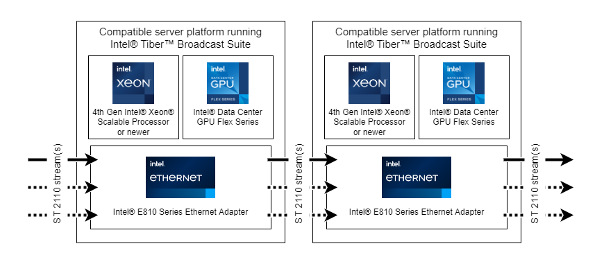

# Hardware and software requirements

## 1. Hardware requirements

Intel® Tiber™ Broadcast Suite is developed and tested on following platforms:

Platform    | CPU         | GPU          | NIC
---         | ---         | ---          | ---
Intel® Server System M50CYP Family| Intel® Xeon® Platinum 8358 CPU  |  Intel® Data Center GPU Flex Series 140/170  | Intel® E810 Series Ethernet Adapter
Inspur NF5280M7         | Intel® Xeon® Platinum 8490H CPU     | Intel® Data Center GPU Flex Series 140/170 | Intel® E810 Series Ethernet Adapter

## 2. Software requirements

Intel® Tiber™ Broadcast Suite is developed and tested on:
 * __Ubuntu 22.04__ with kernel __5.15.0-136-generic__
