# Run guide

> ⚠️ Make sure that all of the hosts used are set up according to the [host setup](build.md).

> ⚠️ To run pipelines with Media Communications Mesh, make sure that [Media Proxy is available](build.md#3-optional-install-media-proxy).

> **Note:** This instruction regards running the predefined scripts from `pipelines` folder present in the root of the repository. For more information on how to prepare an own pipeline, see:
> - [Docker command breakdown](run-know-how.md)
> - [FFmpeg Media Communications Mesh Muxer Parameters Table](plugins/media-communications-mesh.md)
> - [Media Transport Library](plugins/media-transport-library.md)
> - [FFmpeg Intel® JPEG XS Parameters Table](plugins/svt-jpeg-xs.md)
> - [Raisr FFmpeg Filter Plugin Parameters Table](plugins/video-super-resolution.md)

> **Note:** The scaling factors provided in this document consider the number of pixels in the image, instead of dimensions, e.g. scaling 1/4 means the number of overall pixel is down by 4, but the edges are divided by 2 (like in 3840x2160 -> 1920x1080).

## 1. Run sample pipelines

The Intel® Tiber™ Broadcast Suite is a package designed for creation of high-performance and high-quality solutions used in live video production.

Video pipelines described below (sections [2.](#2-multiviewer) - [7.](#7-jpeg-xs-over-media-communications-mesh)) are built using Intel-optimized version of FFmpeg and combine: media transport protocols compliant with SMPTE ST 2110, JPEG XS encoder and decoder, GPU media processing and rendering.

`session A`, `session B` etc. mark separate shell (terminal) sessions. As the Suite is a containerized solution, those sessions can be opened on a single server or multiple servers - on systems connected with each other, after the ports are exposed and IP addresses aligned in pipeline commands.

### 1.1. Sample pipelines setup

To execute Intel® Tiber™ Broadcast Suite pipelines, ensure you have a src folder in your Current Working Directory (CWD) containing  three raw videos. These videos should be in the yuv422p10le 25fps format, which refers to **422 YUV sampling at 10-bit little endian 25 frames per second**.
Additionally, make sure you have the necessary environment variables set. You can use the VARIABLES.rc file in your Current Working Directory for that purpose.

### 1.2. Providing input files
#### 1.2.1. You can provide your own input files

```bash
# Create the src directory if it doesn't exist
mkdir src

# Move your sample videos to the src directory
cp name_of_your_video.yuv src/1080p_yuv422_10b_1.yuv
cp name_of_your_video2.yuv src/1080p_yuv422_10b_2.yuv
cp name_of_your_video3.yuv src/2160p_yuv422_10b.yuv
```

#### 1.2.2. Alternatively, You Can Also Use FFmpeg to Generate Videos with This Format
```bash
# Create the src directory if it doesn't exist
mkdir -p src

# Generate the first 1080p video
ffmpeg -an -y -f lavfi \
-i testsrc=d=5:s=1920x1080:r=25,format=yuv422p10le \
-f rawvideo  src/1080p_yuv422_10b_1.yuv

# Generate the second 1080p video
ffmpeg -an -y -f lavfi \
-i testsrc=d=5:s=1920x1080:r=25,format=yuv422p10le \
-f rawvideo  src/1080p_yuv422_10b_2.yuv

# Generate the 2160p video
ffmpeg -an -y -f lavfi \
-i testsrc=d=5:s=3840x2160:r=25,format=yuv422p10le \
-f rawvideo src/2160p_yuv422_10b.yuv
```

### 1.3. Setting Up VFIO-PCI Addresses
To configure your VFIO-PCI (DPDK binded devices) for use, you'll need to add their PCI addresses to the VARIABLES.rc file located in your Current Working Directory (CWD). Follow these steps to ensure proper setup:
```bash
# Check your vfio-pci device PCI address
dpdk-devbind.py -s
```

Next, create variables in the VARIABLES.rc file to store the PCI addresses for the transmit, receive, and processing devices. Use the following format:
1. **VFIO_PORT_T** - Address for the transmit device.
1. **VFIO_PORT_R** - Address for the receive device.
1. **VFIO_PORT_PROC** - Address for the processing device.

```bash
# Example commands to set VFIO PCI addresses
echo "VFIO_PORT_T=0000:b1:00.0" >> VARIABLES.rc
echo "VFIO_PORT_R=0000:b1:00.1" >> VARIABLES.rc
echo "VFIO_PORT_PROC=0000:b1:00.2" >> VARIABLES.rc
```
Make sure to replace 0000:b1:00.0, 0000:b1:00.1, and 0000:b1:00.2 with the actual PCI addresses you obtained from the dpdk-devbind.py command.

By following these steps, you'll have correctly configured the necessary variables in your VARIABLES.rc file for your DPDK binded devices.

### 1.4. Optional for bare-metal

📝 **Notice:** To run the pipelines using the bare-metal installation of the Intel® Tiber™ Broadcast Suite, include the `-l` argument with the pipeline scripts:

```bash
./pipelines/<pipelines_script_example>.sh -l
```

in local mode you also need to have kahawai.json in your Current Working Directory [kahawai.json](../kahawai.json).

## 2. Multiviewer

Input streams from eight ST 2110-20 cameras are scaled down and composed into a tiled 4x2 multi-view of all inputs on a single frame.

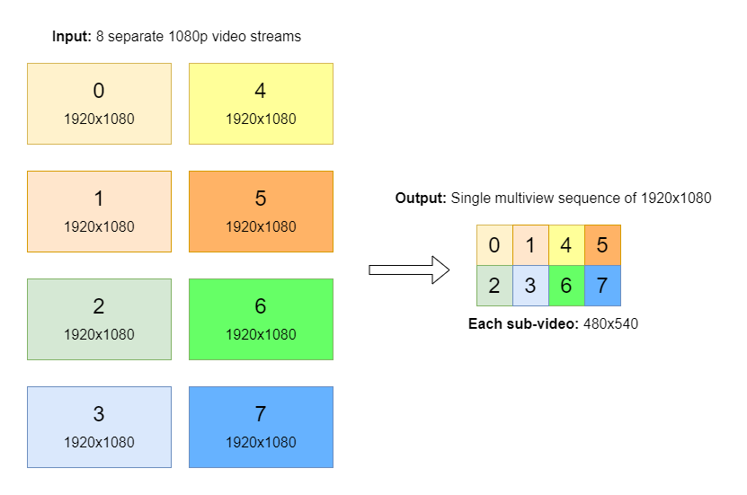

Scaling and composition are examplary operations that can be replaced by customers with their own visualization apps, for example OpenGL- or Vulcan-based.

Pipeline outputs a single ST 2110 stream.

The example also shows how to use GPU capture to encode a secondary AVC/HEVC stream that can be transmitted with WebRTC for preview.

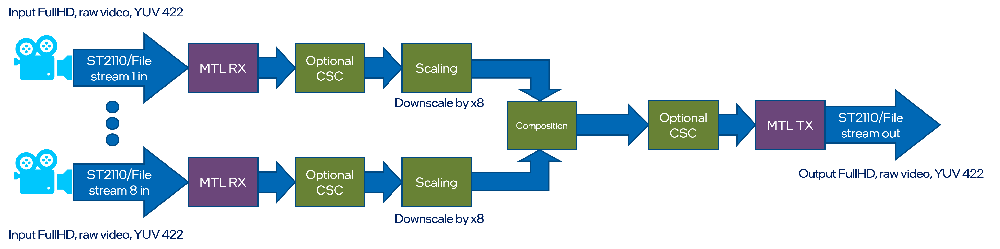

Execute a following set of scripts in according terminal sessions to run the Multiviewer pipeline:
```text
session A > multiviewer_tx.sh
session B > multiviewer_process.sh
session C > multiviewer_rx.sh
```


## 3. Recorder

Input streams from ST 2110-20 camera is split to two streams with different 1/4 and 1/16 pixelwise scaling. Scaled outputs are stored on local drive.

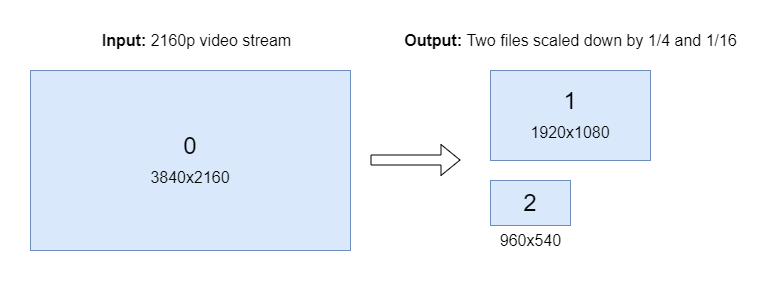
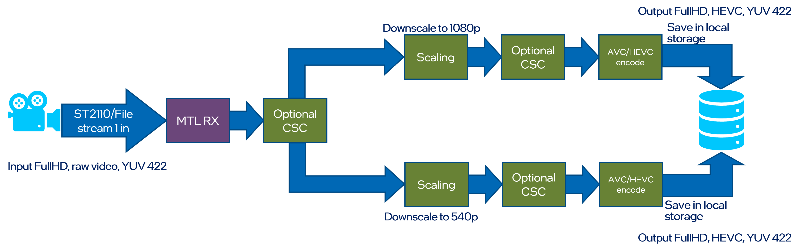

Execute a following set of scripts in according terminal sessions to run the Recorder pipeline:
```text
session A > recorder_tx.sh
session B > recorder_rx.sh
```


## 4. Replay

Input streams from two ST 2110-20 camera and are blended together. Blended output is send out via ST 2110 stream.

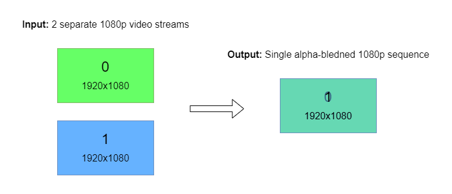
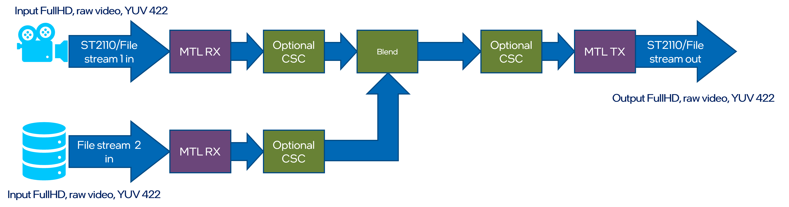

Execute a following set of scripts in according terminal sessions to run the Replay pipeline:
```text
session A > replay_tx.sh
session B > replay_process.sh
session C > replay_rx.sh
```


## 5. Upscale

Input streams from ST 2110-20 camera is scaled up using Video Super Resolution from FullHD to the 4K resolution. Output is send out via ST 2110-20 stream.

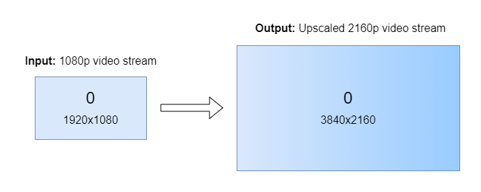
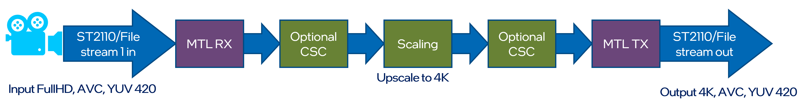

Execute a following set of scripts in according terminal sessions to run the Upscale pipeline:
```text
session A > upscale_tx.sh
session B > upscale_process.sh
session C > upscale_rx.sh
```


## 6. JPEG XS

Two input streams from local drive are encoded using JPEG XS codec and send out using ST 2110-22 streams.
Input streams from two ST 2110-22 camera are decoded using JPEG XS codec stored on local drive.

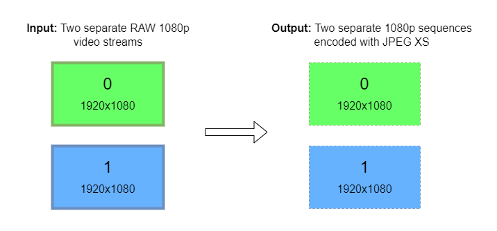
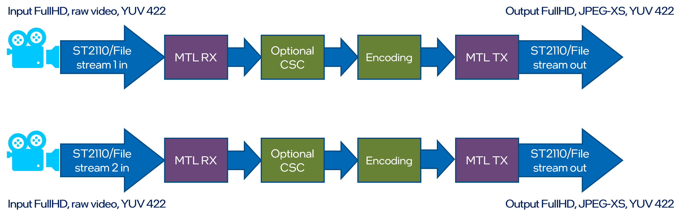

Execute a following set of scripts in according terminal sessions to run the JPEG XS pipeline:
```text
session A > jpeg_xs_tx.sh
session B > jpeg_xs_rx.sh
```


## 7. JPEG XS over Media Communications Mesh

Two input streams from local drive are encoded using JPEG XS codec and send out via Media Communications Mesh using ST2110-22 streams.
Input streams from two ST2110-22 cameras are decoded using JPEG XS codec stored on local drive.

> ⚠️ **Warning:** You need to have the [Media Proxy](https://github.com/OpenVisualCloud/Media-Communications-Mesh/tree/main?tab=readme-ov-file#dockerfiles-build) installed to run this pipeline.


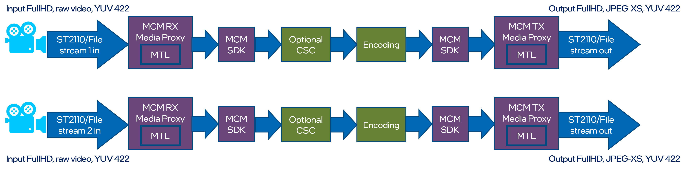

Example command to run the pipeline:
```text
session A > mcm_media_proxy_rx.sh
session B > mcm_media_proxy_tx.sh
session C > mcm_jpeg_xs_rx.sh
session D > mcm_jpeg_xs_tx.sh
```


<!-- Temporarily hidden
## 8. Video production pipeline
This pipeline does not have its equivalent in code at the moment, but shows a production-ready solution that could be built using Intel® Tiber™ Broadcast Suite.

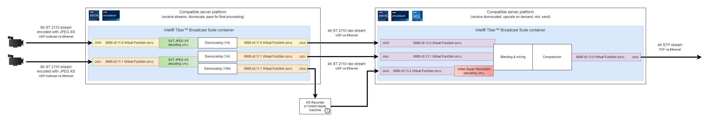

Two 8K cameras capable of sending ST 2110 stream with video encoded using JPEG XS codec, send their streams using UDP multicast.

Server A receives the streams by two Virtual Functions of Intel® E810 Series Ethernet Adapter card used within a single Intel® Tiber™ Broadcast Suite container. Both streams are decoded with low latency using accelerated SVT JPEG XS on Intel® Xeon® Scalable Processor. One stream is downscaled to 1/4th of the size (to 4K), and the other is downscaled to 1/4th and 1/64th of the size (to 4K and 1080p).

Both 4K streams are sent with the same Virtual Functions they were received with to the next container running on Server B. 1080p stream is also sent to a Recorder/Instant replay machine for archival and replay possibility.

Server B receives three streams, two 4K (close to) real-time ones, and one delayed 1080p stream used for replays. The smallest one is later upscaled with Video Super Resolution on Intel® Data Center GPU Flex Series card to match 4K output.

All of the streams are blended and mixed based on predefined instructions. The output is then compressed and sent using RTP protocol (TCP) as a 4K stream.
-->
