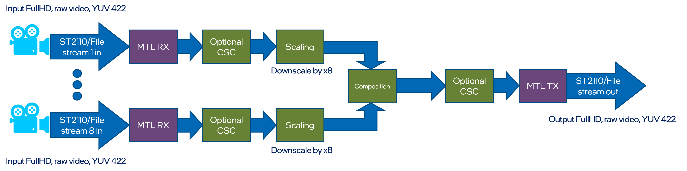

# Run guide

> ⚠️ Make sure that host is ready. Check list of requirements to run [host setup](build.md)


## Run sample pipelines

The Intel® Tiber™ Broadcast Suite is a software-based package designed for creation of high-performance and high-quality solutions used in live video production.
The video pipelines are built using Intel-optimized version of FFmpeg and combine: media transport protocols (SMPTE ST 2110-compliant), JPEG-XS encoding/decoding, GPU media processing and rendering.

---

### Multiviewer

Input streams from multiple ST2110 cameras are scaled down and composed into a tiled multi-view of all inputs on a single frame. Scaling and composition are example operations that will be replaced by customers with their visualization apps. Majority of customers use OpenGL as a visualization app. The live video streaming solution should allow integrating either OpenGL or Vulkan applications, with OpenGL being target for example pipeline.These apps already exist and use OpenGL which we must also support. Pipeline output is a single ST2110 stream. The example also shows how to use GPU capture to encode a secondary AVC/HEVC stream that can be transmitted with WebRTC for preview.

Note that both input and output are expected to use Y’CRCB 10b BT2110 HLG with BT2020 Color Gamut, but there might be optional color space conversions to improve performance or for specific customer requirements.

For development and integration ease, input/output to support either input from file or from network.

There are separate docker files for camera (TX) and multiviewer (RX) pipelines. The TX/RX pipelines should be executed on separate nodes for performance testing. Alternatively, one can launch both pipelines on a single node using two terminals and the following command lines:



Example command to run Multiviewer pipeline:
```
TBD: Will be added when exact pipeline will be ready
```
---
### Recorder

Input streams from ST2110 camera is divided to two streams with different resolution. Scaled outputs are stored on local drive.


Example command to run Recorder pipeline:
```
TBD: Will be added when exact pipeline will be ready
```
---
### Replay

Input streams from ST2110 camera and from local storage are blended together. Blended output is send out via ST2110 stream.


Example command to run Replay pipeline:
```
TBD: Will be added when exact pipeline will be ready
```
---
### Upscale

Input streams from ST2110 camera is scaled up using Video Super Resolution from FullHD to the 4K resolution. Output is stored on local drive.


Example command to run Upscale pipeline:
```
TBD: Will be added when exact pipeline will be ready
```
---
### JPEG-XS

Two input streams from ST2110 cameras are encoded using JPEG-XS coded and send out using also ST2110 streams.


Example command to run JPEG-XS pipeline:
```
TBD: Will be added when exact pipeline will be ready
```
