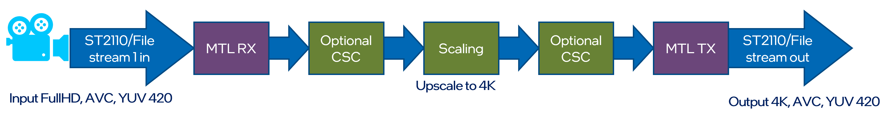

# Run guide

> ⚠️ Make sure that host is ready. Check list of requirements to run [host setup](build.md)


## Run sample pipelines

The Intel® Tiber™ Broadcast Suite is a software-based package designed for creation of high-performance and high-quality solutions used in live video production.
The video pipelines are built using Intel-optimized version of FFmpeg and combine: media transport protocols (SMPTE ST 2110-compliant), JPEG-XS encoding/decoding, GPU media processing and rendering.

All scripts mentioned below are stored in ```<repo_dir>/pipelines/``` directory

---

### Multiviewer

Input streams from eight ST2110-20 cameras are scaled down and composed into a tiled 4x2 multi-view of all inputs on a single frame. Scaling and composition are example operations that will be replaced by customers with their visualization apps. Majority of customers use OpenGL as a visualization app. The live video streaming solution should allow integrating either OpenGL or Vulkan applications, with OpenGL being target for example pipeline.These apps already exist and use OpenGL which we must also support. Pipeline output is a single ST2110 stream. The example also shows how to use GPU capture to encode a secondary AVC/HEVC stream that can be transmitted with WebRTC for preview.


Example command to run Multiviewer pipeline:
```
terminalA>multiviewer_tx.sh
terminalB>multiviewer_process.sh
terminalC>multiviewer_rx.sh
```
---
### Recorder

Input streams from ST2110-20 camera is split to two streams with different resolution 1/4 and 1/16. Scaled outputs are stored on local drive.


Example command to run Recorder pipeline:
```
terminalA>recorder_tx.sh
terminalB>recorder_rx.sh
```
---
### Replay

Input streams from two ST2110-20 camera and are blended together. Blended output is send out via ST2110 stream.


Example command to run Replay pipeline:
```
terminalA>replay_tx.sh
terminalB>replay_process.sh
terminalC>replay_rx.sh
```
---
### Upscale

Input streams from ST2110-20 camera is scaled up using Video Super Resolution from FullHD to the 4K resolution. Output is send out via ST2110-20 stream.



Example command to run Upscale pipeline:
```
terminalA>upscale_tx.sh
terminalB>upscale_process.sh
terminalC>upscale_rx.sh
```
---
### JPEG-XS

Two input streams from local drive are encoded using JPEG-XS codec and send out using ST2110-22 streams.
Input streams from two ST2110-22 camera are decoded using JPEG-XS codec stored on local drive.


Example command to run JPEG-XS pipeline:
```
terminalA>jpeg_xs_tx.sh
terminalB>jpeg_xs_rx.sh
```
