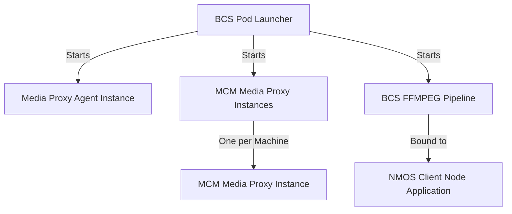

# BCS pod launcher

BCS pod launcher starts once Media Proxy Agent instance (on one machine) and MCM Media Proxy instances on each machine. It enables to starts BCS ffmpeg pipeline with bound NMOS client node application.



**BCS Pod Launcher** is the central controller that starts all other components.  
**Media Proxy Agent** Instance is a single instance started by the BCS Pod Launcher on one machine.  
**MCM Media Proxy** Instances is a multiple instances started by the BCS Pod Launcher, one on each machine.  
**BCS FFMPEG Pipeline** is a pipeline started by the BCS Pod Launcher whereas **NMOS Client Node Application** is bound to the BCS FFMPEG Pipeline for media management and discovery. And this pair of containers  that are working seperate containers either standalone or within one pod.  
  
There are 2 possible use cases:

- run in containerized mode - `<repo>/launcher/internal/container_controller/container_controller.go` implements a DockerContainerController that is responsible for managing Docker containers based on the launcher configuration. The DockerContainerController is designed to:
  - Parse the launcher configuration file.
  - Create and run Docker containers based on the parsed configuration.
  - Handle container lifecycle operations such as checking if a container is running, removing existing containers, and starting new ones based on input configuration file in json format.

- run in orchestrated mode in cluster using kuberenetes - `<repo>/launcher/internal/controller/bcsconfig_controller.go` implements the Kubernetes controller logic for managing `BcsConfig` custom resources. This controller is responsible for reconciling the state of the cluster with the desired state defined in the BcsConfig resources. The BcsConfigReconciler is designed to:
  - Watch for changes to BcsConfig custom resources.
  - Reconcile the desired state by creating or updating Kubernetes resources such as ConfigMaps, Deployments, and Services.
  - Ensure that the BcsConfig resources are correctly applied and maintained in the cluster.

> Prerequisite is to build 4 images in advance if you do not have access to any registry with released images:
> - mesh-agent
> - media-proxy
> - tiber-broadcast-suite (in this scenario it is Broadcast Suite pipeline app - ffmpeg)
> - tiber-broadcast-suite-nmos-node (NMOS client app)

## Prerequisite - build necessary images

### mesh-agent and media-proxy

It is recommended to use [Setup Guide Media Communications Mesh](<https://github.com/OpenVisualCloud/Media-Communications-Mesh/blob/main/build_docker.sh>) and complete the steps with runing script [build_docker.sh](https://github.com/OpenVisualCloud/Media-Communications-Mesh/blob/main/build_docker.sh). No need to execute `docker run` or `kubectl apply/create`. BCS launcher will do it for you.

### tiber-broadcast-suite and tiber-broadcast-suite-nmos-node
```bash
git clone https://github.com/OpenVisualCloud/Intel-Tiber-Broadcast-Suite.git Intel-Tiber-Broadcast-Suite
cd Intel-Tiber-Broadcast-Suite
./build.sh
./first-run.sh
```
> NOTE MTL manager image is build together with tiber-broadcast-suite
tiber-broadcast-suite-nmos-node images using script `build.sh`. MTL manager container is run due to `first-run.sh`. In this version BCS launcher has not supported running MTL manager container yet.In this version BCS launcher has already supported  MTL manager deployment, but make sure before run of BCS launcher that MTL manager container is not running as a standalone app. MTL manager is necessary to run scenario with stream type ST2110.

## Description

The tool can operate in two modes:

- Kubernetes Mode: For multi-node cluster deployment.
- Docker Mode: For single-node using Docker containers.

**Flow (Common to Both Modes)**

1. Run MediaProxy Agent
2. Run MCM Media Proxy
3. Run BcsFfmpeg pipeline with NMOS

In case of docker, MediaProxy/MCM things should only start/run once and on every run of launcher, one should start the app according to input file. It does not store the state of apps, just check appropriate conditions.

In case of kuberenetes, MediaProxy/MCM things should only be run once and BCS pod launcher works as operator in the understanding of Kuberenetes operators within pod. That is way, input file in this way is CustomReaource called BcsConfig.

## Getting Started

### Prerequisites

- go version v1.22.0+
- docker version 17.03+.
- kubectl version v1.27+
- Access to a Kubernetes v1.11.3+ cluster.

### To Run containers on single node

**step #1** Note that you have to adjust **NMOS** node configuration file. Examples with use cases you can find under the path  `<repo>/tests` (Files in json format).  

**step #2** Remember the path of above mentioned configuration NMOS file because it must be provided in the next config below: `<repo>/launcher/configuration_files/bcslauncher-static-config.*.yaml`.

```json
nmosConfigPath: /example/nnmos/configuration/from/path/<repo>/tests
nmosConfigFileName: intel-nmos-node-example.json
```

Edit this configuration file under path `<repo>/launcher/configuration_files/bcslauncher-static-config.yaml` This example shows `<repo>/launcher/configuration_files/bcslauncher-static-config-host-net-tx.yaml`:

```yaml
# 
# SPDX-FileCopyrightText: Copyright (c) 2024 Intel Corporation
# 
# SPDX-License-Identifier: BSD-3-Clause
# 
# CONFIGURATION FOR mediaProxyAgent AND mediaProxyMcm MUST BE THE SAME WITHIN THE SAME NETWORK/SETUP
# CONFIGURATION FOR mediaProxyAgent AND mediaProxyMcm IS FOR ONE NODE SCENARIO ONLY

k8s: false # use flag in both modes: k8s | docker
configuration: # Configuration should be used only for docker mode
  runOnce:
    mediaProxyAgent:
      imageAndTag: mcm/mesh-agent:latest # built locally
      gRPCPort: 50051 # this is the port used by the agent
      restPort: 8100
      custom_network: # custom network = false means that the container will be run in the host docker network
        enable: false
    mediaProxyMcm:
      imageAndTag: mcm/media-proxy:latest # built locally
      interfaceName: eth0
      volumes:
        - /dev/vfio:/dev/vfio
      custom_network: # custom network = false means that the container will be run in the host docker network
        enable: false
  workloadToBeRun:
    ffmpegPipeline:
      name: bcs-ffmpeg-pipeline-tx
      imageAndTag: tiber-broadcast-suite:latest # built locally
      gRPCPort: 50088 # this is the port used by the nmos container to communicate with ffmpeg pipeline
      nmosPort: 5004 # this is the port used by the nmos container to manage node via REST API
      environmentVariables:
        - "http_proxy="
        - "https_proxy=" 
      volumes:
        videos: /root #for videos to be stored
        dri: /usr/lib/x86_64-linux-gnu/dri
        kahawai: /tmp/kahawai_lcore.lock
        devnull: /dev/null
        tmpHugepages: /tmp/hugepages
        hugepages: /hugepages
        imtl: /var/run/imtl
        shm: /dev/shm
      devices:
        vfio: /dev/vfio
        dri: /dev/dri
      custom_network:  # custom network = false means that the container will be run in the host docker network
        enable: false
        ip: 10.123.x.x # this IP address is crucial to be exposed explicitly to the NMOS node. It should be the same as host IP address or localhost
    nmosClient:
      name: bcs-ffmpeg-pipeline-nmos-client-tx
      imageAndTag: tiber-broadcast-suite-nmos-node:latest # built locally
      environmentVariables:
        - "http_proxy="
        - "https_proxy=" 
        - "VFIO_PORT_TX=0000:ca:11.0" # this is the PCI address of the vfio device - MANDATORY!
      nmosConfigPath: /root/path/to/intel-node-tx/json/file
      nmosConfigFileName: intel-node-tx.json
      custom_network:  # custom network = false means that the container will be run in the host docker network
        enable: false
```

#### Parameters explaination

1. `k8s: false` it indicates single node scenario: the configuration is designed for a single-node setup, meaning that components mediaProxyAgent and mediaProxyMcm are expected to run on the same machine.
Consistency: The configurations for mediaProxyAgent and mediaProxyMcm must be identical within the same network/setup/host to ensure proper communication.
Modes: The k8s flag determines whether the setup is for Kubernetes (k8s: true) or Docker (k8s: false).

2. `runOnce` section defines the containers that need to be run once during the setup.
   - For `mediaProxyAgent`, `image` must be built locally (instructios above).
   Ports:
   `gRPCPort` is used by the agent for gRPC communication.
   `restPort` is used for REST API communication.
   Custom Network:
   `enable: false`: the container will use the host's Docker network.  
   - For `mediaProxyMcm`
   `image` must be built locally.
   `iterfaceName` is physical network interface used by the container.
   `volumes` should be existing paths on the host.
   Custom Network:
   `enable: false`: The container will use the host's Docker network.

3. `workloadToBeRun` section defines the workloads that need to be executed.
  - For `ffmpegPipeline` `image`must be built locally. Ports:
  `gRPCPort`is used by the NMOS container to communicate with the FFmpeg pipeline.
  `nmosPort` is used by the NMOS container for NMOS REST API communication. For example this port is used by NMOS registry or NMOS controller to send the REST requests to your NMOS node. Environment Variables:
  `http_proxy` and `https_proxy` are proxy settings (left empty in this configuration).
  `volumes` maps various host directories to the container for video storage, device access, and shared memory. `volumes`' paths should be existing paths on the host. `videos` volume points to location where videos are stored.
  `devices` maps VFIO and DRI devices from the host to the container.
  Custom Network: `enable: false` means the container will use the host's Docker network.
  `ip: 10.123.x.x` is **the IP address must match the host's IP or localhost for proper NMOS node communication.**
  - For `nmosClient` `image`must be built locally. Environment Variables:
  `VFIO_PORT_TX` is the PCI address of the VFIO device (mandatory for proper operation).
  NMOS Configuration: `nmosConfigPath` is path to the NMOS configuration JSON file.
  `nmosConfigFileName` is name of the NMOS configuration file.
  Custom Network: `enable: false` means the container will use the host's Docker network.

In the case of using this file with the `custom_network: true` (files `<repo>/launcher/configuration_files/bcslauncher-static-config-custom-net-.*.yaml`) the only diffrence is in the snippet:

```yaml
custom_network:
  enable: true
  name: <bcs-custom-net>
  ip: <ip-address>
```

You need to provide the name of docker network (for example the one that is created using script `<repo>/scripts/first_run.sh` and you can list its name `$ docker network ls`) and assign the IP address according to defined rules and subnet.

> **`IMPORTANT NOTE!`** It is worth noting that workloads under key `runOnce` are configurable globally and only once, whereas `workloadToBeRun` can be defined many times for diffrent workloads (so under the same path, change the content of the file). The flag should be set as `k8s: false`.


#### How to run BCS launcher for docker containers?

```bash

cd <repo>/launcher/cmd/
go build main.go
./main --bcs-config-path=<pass/path/to/file/launcher/configuration_files/<<your configuration file>>.yaml>
# Alternatively instead of go build main.go && ./main, you can type: go run main.go --bcs-config-path=<pass/path/to/file/launcher/configuration_files/<<your configuration file>>.yaml>
```

### To Deploy on the cluster (kubernetes sceario)

> **IMPORTANT NOTE!** The prerequisite is to prepare cluster (for example the simplest one using the link below): [Creating a cluster with kubeadm](https://kubernetes.io/docs/setup/production-environment/tools/kubeadm/create-cluster-kubeadm/)

**Build image:**

```bash
cd <repo>/launcher
docker build -t bcs_pod_launcher:controller .
```

> NOTE! If you have issues with building, try to add proxy environment variables. `--build-arg http_proxy=<proxy>` and `--build-arg https_proxy=<proxy>`. Example: `docker build --build-arg http_proxy=<proxy> --build-arg https_proxy=<proxy> -t bcs_pod_launcher:controller .`

Modify ConfigMap `<repo>/launcher/configuration_files/bcslauncher-k8s-config-map.yaml`. `k8s: true` should be set. Resources for media proxy and mesh agent are only configured once within runtime of the cluster. Configuration can be changed in above mentioned ConfigMap, however the changes will be applied when *reconciler loop* runs in BCS launcher controller (e.g. after applying/updating any `BcsConfig` custom resource)

#### Explanation of ConfigMap

It is used to store configuration data that can be consumed by applications running in a Kubernetes cluster.  
**`data`** holds the actual configuration data. The `data` section contains a single key, `config.yaml`, which holds a multi-line YAML configuration. This is where the application-specific configuration is defined.  

 **`k8s`**
- A boolean flag (`true`) indicating Kubernetes-specific behavior.

 **`definition`**
- Contains the configuration for different components of the system.

---

##### Component-Specific Keys
Each component (e.g., `meshAgent`, `mediaProxy`, `mtlManager`) has its own configuration:

**`meshAgent`**
- **`image`**: Docker image for the `meshAgent` component.
- **`restPort` / `grpcPort`**: ports used for REST and gRPC communication.
- **`requests`**: resource requests for CPU and memory (minimum guaranteed resources).
- **`limits`**: resource limits for CPU and memory (maximum allowed resources).
- **`scheduleOnNode`**: node selector to schedule the pod on specific nodes (e.g., nodes with the label `node-role.kubernetes.io/worker=true`). [optional]
- **`doNotScheduleOnNode`**: node selector to omit schedule process of the pod on specific nodes [optional]

#### **`mediaProxy`**
- **`image`**: Docker image for the `mediaProxy` component.
- **`command`** / **`args`**: command and arguments to run the container.
- **`grpcPort` / `sdkPort`**: ports for gRPC and SDK communication.
- **`requests` / `limits`**: resource requests and limits, including hugepages for memory optimization.
- **`volumes`**: refines volume mounts for the container (e.g., `memif`, `vfio`).
- **`pvHostPath`**: host path for persistent volume.
- **`pvStorageClass`**: storage class for the persistent volume.
- **`pvStorage` / `pvcStorage`**: storage size for the persistent volume and PVC.
- **`pvcAssignedName`**: name of the PersistentVolumeClaim (PVC).
- **`scheduleOnNode`**: node selector to schedule the pod on specific nodes (e.g., nodes with the label `node-role.kubernetes.io/worker=true`). [optional]
- **`doNotScheduleOnNode`**: node selector to omit schedule process of the pod on specific nodes [optional]


**`mtlManager`**
- **`image`**: Docker image for the `mtlManager` component.
- **`requests` / `limits`**: Resource requests and limits.
- **`volumes`**: Volume mounts for the container (e.g., `imtlHostPath`, `bpfPath`).
- **`scheduleOnNode`**: node selector to schedule the pod on specific nodes (e.g., nodes with the label `node-role.kubernetes.io/worker=true`). [optional]
- **`doNotScheduleOnNode`**: node selector to omit schedule process of the pod on specific nodes [optional]

---

Modify CustomResource called `BcsConfig` (custom object in Kubernetes)`<repo>/launcher/configuration_files/bcsconfig-k8s-custom-resource-example.yaml` to prepare information for bcs pipeline and NMOS node. There may be many custom resources that specifies diffrent `workloads` with NMOS node.

##### Component-specific keys under `spec`

- **`name`**: the name of the application (tiber-broadcast-suite).
- **`namespace`**: the namespace where the application operates (bcs).
- **`app`**: configuration for the main stream application (e.g. ffmpeg).
  - **`image`**: container image to use (e.g. built locally)
  - **`grpcPort`**: gRPC port exposed by the application (50051).
  - **`resources`**: resource requests and limits for the container:
  - **`requests`**: minimum resources required (e.g., 500m CPU, 256Mi memory and hugepages).
  - **`limits`**: maximum resources allowed (e.g., 1000m CPU, 512Mi memory and hugepages).
  - **`environmentVariables`**: Environment variables for the container (e.g., `http_proxy` and `https_proxy`).
  - **`volumes`**: Volume mappings for the container (e.g., videos mapped to location where videos are stored on the host).

- **`nmos`**: configuration for the NMOS component:
  - **`image`**: the container image for NMOS (built locally)
  - **`args`**: command-line arguments for the container. As an argument, a path to NMOS configuration file is passed: `["config/config.json"]`. It should be left as default, because it will be mounted as volume in ConfigMap
  - **`environmentVariables`**: environment variables specific to NMOS. The most important ENVIRONMENT VARIABLE called **`VFIO_PORT_TX or VFIO_PORT_RX`** (depending on scenario):
  ```yaml
      - name: "http_proxy"
        value: ""
      - name: "https_proxy"
        value: ""
      - name: "VFIO_PORT_TX"
        value: "0000:ca:11.0"
   ```
  - **`nmosApiNodePort`**: node port for the NMOS API.
  - **`resources`**: resource requests and limits for the NMOS container.
  - **`nmosInputFile`**: configuration for NMOS input. The detailed parameters are described under `<repo>/src/nmos/nmos-node/README.md`. **Remember to adjust this configuration too to your needs!**

**BCS pod launcher installer in k8s cluster:**  

Users can just run kubectl apply -f <file> to install the project:
**Deploy**
```bash
cd <repo>/launcher/
kubectl apply -f ./configuration_files/bcslauncher-k8s-config-map.yaml
kubectl apply -f ./configuration_files/bcsconfig-crd.yaml
kubectl apply -f ./configuration_files/bcs-launcher.yaml
# Check if BCS launcher controller is up-and-running
kubectl get pods -n bcs
# If it works fine, adjust to your needs: ./configuration_files/bcsconfig-k8s-custom-resource-.*.yaml
kubectl apply -f ./configuration_files/bcsconfig-k8s-custom-resource-example.yaml
```

**Delete**
```bash
kubectl delete -f ./configuration_files/bcslauncher-k8s-config-map.yaml
kubectl delete -f ./configuration_files/bcsconfig-crd.yaml
kubectl delete -f ./configuration_files/bcs-launcher.yaml
kubectl delete -f ./configuration_files/bcsconfig-k8s-custom-resource-example.yaml
```

**BCS pod launcher roles of files in k8s cluster:**  

- `configuration_files/bcslauncher-k8s-config-map.yaml` -> configmap for setting up the mode of launcher. `k8s: true` defines Kubernetes mode. Currently, you should not modify this in that file.  
- `configuration_files/bcsconfig-crd.yaml` -> object definition - CustomResourceDefinition for `BcsConfig`  
- `configuration_files/bcs-launcher.yaml` -> install set of kuberenetes resources that are needed to run bcs pod luancher, no additional configuration required
- `configuration_files/bcsconfig-k8s-custom-resource-example.yaml` -> example `BcsConfig` file that it is an input to provide information about **bcs ffmpeg piepeline and NMOS client**, you can adjust file to your needs,

## License

SPDX-FileCopyrightText: Copyright (c) 2025 Intel Corporation

SPDX-License-Identifier: BSD-3-Clause

===============================================================

Copyright 2024.

Licensed under the Apache License, Version 2.0 (the "License");
you may not use this file except in compliance with the License.
You may obtain a copy of the License at

    http://www.apache.org/licenses/LICENSE-2.0

Unless required by applicable law or agreed to in writing, software
distributed under the License is distributed on an "AS IS" BASIS,
WITHOUT WARRANTIES OR CONDITIONS OF ANY KIND, either express or implied.
See the License for the specific language governing permissions and
limitations under the License.
*