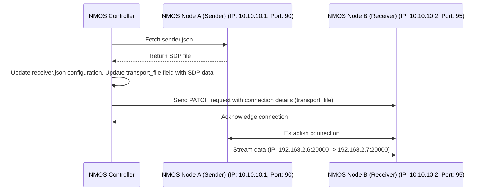
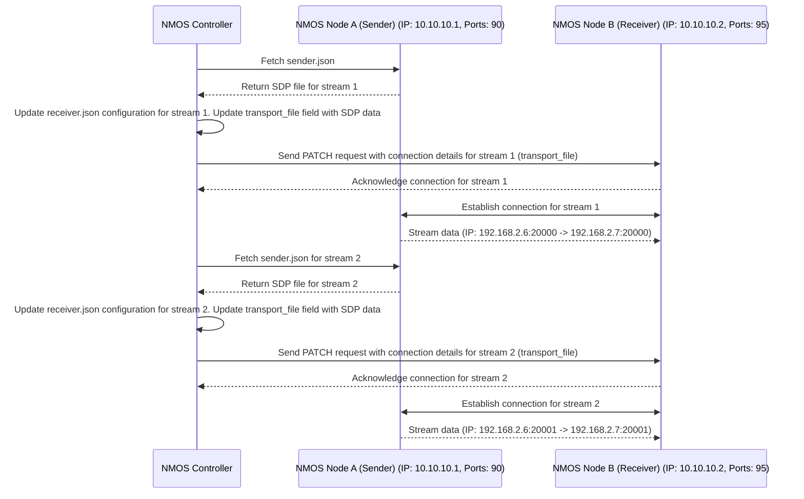

# NMOS controller that tests IS-04 and IS-05 - for testig purposes
## Flow

This script will activate NMOS node sender and another NMOS node receiver, fetch data from the specified NMOS sender and receiver nodes, update the necessary JSON configuration files, and send PATCH requests to the receiver to establish the connection between two nodes.

Connection flow is realized accordingly to the [AMWA IS-05 specification](https://specs.amwa.tv/is-05/releases/v1.1.2/docs/Overview.html)


*Figure: Connection Flow Diagram. Source: [AMWA IS-05 Specification](https://specs.amwa.tv/is-05/releases/v1.1.2/docs/Overview.html).*

## Usage

Provide the appropriate IP addresses and ports for the sender NMOS node A and receiver NMOS node B.

```bash
python3 threaded-nmos-controller05.py \
  --sender_ip <ip-address-nmos-node-A-sender> \
  --sender_port <port-nmos-node-A-sender> \
  --receiver_ip <ip-address-nmos-node-B-receiver> \
  --receiver_port <port-nmos-node-B-receiver> \
  --receiver_index <index-of-B-receiver> \
  --sender_index <index-of-A-sender> \
  --receiver_interface_ip <receiver-B-interface-ip> \
  --sender_destination_ip <sender-A-destination-ip> \
  --sender_destination_port <sender-A-destination-port> \
  --sender_source_ip <sender-A-source-ip> \
  --sender_source_port <sender-A-source-port>
```

### Parameters

- `--sender_ip`: The IP address of the NMOS Node A sender.
- `--sender_port`: The port number of the NMOS Node A sender.
- `--receiver_ip`: The IP address of the NMOS Node B receiver.
- `--receiver_port`: The port number of the NMOS Node B receiver.
- `--receiver_index`: The index of the receiver in the list of available receivers. This is useful when multiple receivers are configured, and you want to specify which one to use.
- `--sender_index`: The index of the sender in the list of available senders. This is useful when multiple senders are configured, and you want to specify which one to use.
- `--receiver_interface_ip`: The IP address of the network interface on the receiver node. This is the interface that will be used to receive the media stream.
- `--sender_destination_ip`: The destination IP address where the sender will send the media stream. This is typically the IP address of the receiver node.
- `--sender_destination_port`: The destination port number where the sender will send the media stream. This is typically the port on the receiver node.
- `--sender_source_ip`: The source IP address of the sender node. This is the IP address of the sender node that will transmit the media stream.
- `--sender_source_port`: The source port number of the sender node. This is the port on the sender node that will be used to transmit the media stream.




This diagram illustrates the interaction between the NMOS Controller, Sender Node, and Receiver Node during the connection process, with the Controller serving as an intermediary to establish the connection.

⚠️ **Note:**:
Each connection between a sender and a receiver must be established separately, even when multiple senders or receivers are aggregated within a single FFmpeg instance.



This diagram illustrates the interaction between the NMOS Controller, Sender Node, and Receiver Node during the connection process for two separate streams, with the Controller serving as an intermediary to establish both connections.

### Example 1: Single Stream between Node A and Node B

Below is an example of how to establish a connection between two NMOS nodes (Node A as sender and Node B as receiver) using the NMOS Controller. This example assumes that you have two NMOS nodes configured with the specified IP addresses and ports.

```bash
python3 threaded-nmos-controller05.py \
  --sender_ip 192.168.1.10 \
  --sender_port 5000 \
  --receiver_ip 192.168.1.20 \
  --receiver_port 6000 \
  --receiver_index 0 \
  --sender_index 0 \
  --receiver_interface_ip 192.168.1.21 \
  --sender_destination_ip 192.168.1.21 \
  --sender_destination_port 7000 \
  --sender_source_ip 192.168.1.11 \
  --sender_source_port 8000
```

### Example 2: Multiple Streams Between Node A and Node B

Below are example Python commands to establish connections for two separate streams using the NMOS Controller. Each command corresponds to a different stream configuration, allowing you to set up multiple streams between NMOS Node A (Sender) and NMOS Node B (Receiver).


```bash
# Stream #1
python3 threaded-nmos-controller05.py \
  --sender_ip 10.10.10.1 \
  --sender_port 90 \
  --receiver_ip 10.10.10.2 \
  --receiver_port 95 \
  --receiver_index 0 \
  --sender_index 0 \
  --receiver_interface_ip 192.168.2.7 \
  --sender_destination_ip 192.168.2.7 \
  --sender_destination_port 20000 \
  --sender_source_ip 192.168.2.6 \
  --sender_source_port 20000
  ```

```bash
# Stream #2
python3 threaded-nmos-controller05.py \
  --sender_ip 10.10.10.1 \
  --sender_port 90 \
  --receiver_ip 10.10.10.2 \
  --receiver_port 95 \
  --receiver_index 1 \
  --sender_index 1 \
  --receiver_interface_ip 192.168.2.7 \
  --sender_destination_ip 192.168.2.7 \
  --sender_destination_port 20001 \
  --sender_source_ip 192.168.2.6 \
  --sender_source_port 20001
```

These configurations demonstrate how to set up the sender and receiver nodes for two separate streams using the specified IP addresses and ports.