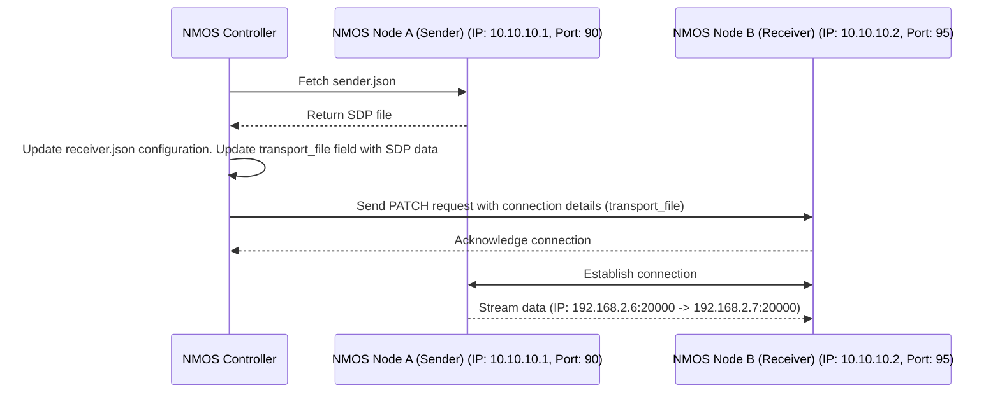
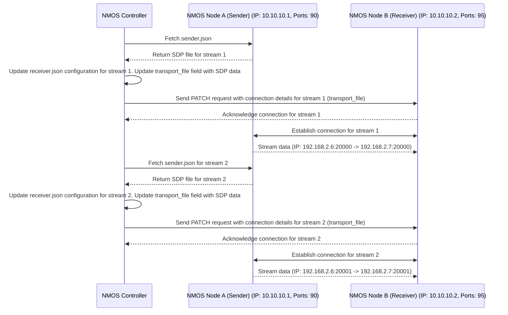

# NMOS controller that tests IS-04 and IS-05 - for testig purposes
## Flow

This script will activate NMOS node sender and another NMOS node receiver, fetch data from the specified NMOS sender and receiver nodes, update the necessary JSON configuration files, and send PATCH requests to the receiver to establish the connection between two nodes.

Connection flow is realized accordingly to the [AMWA IS-05 specification](https://specs.amwa.tv/is-05/releases/v1.1.2/docs/Overview.html)


*Figure: Connection Flow Diagram. Source: [AMWA IS-05 Specification](https://specs.amwa.tv/is-05/releases/v1.1.2/docs/Overview.html).*

## Usage

Provide the appropriate IP addresses and ports for the sender NMOS node A and receiver NMOS node B.

```bash
python3 threaded-nmos-controller05.py --sender_ip <ip-address-nmos-node-a-sender> --sender_port <port-nmos-node-a-sender> --receiver_ip <ip-address-nmos-node-b-receiver> --receiver_port <port-nmos-node-b-receiver>
```

### Parameters

- `--sender_ip`: The IP address of the NMOS Node A sender.
- `--sender_port`: The port number of the NMOS Node A sender.
- `--receiver_ip`: The IP address of the NMOS Node B receiver.
- `--receiver_port`: The port number of the NMOS Node B receiver.

### Example 1: Single Stream

```bash
python3 threaded-nmos-controller05.py --sender_ip 10.10.10.1 --sender_port 90 --receiver_ip 10.10.10.2 --receiver_port 95
```


This diagram illustrates the interaction between the NMOS Controller, Sender Node, and Receiver Node during the connection process, with the Controller serving as an intermediary to establish the connection.

⚠️ **Note:**:
Each connection between a sender and a receiver must be established separately, even when multiple senders or receivers are aggregated within a single FFmpeg instance.

### Example Configuration Files

Below are example configurations for `sender.json` and `receiver.json` based on the IP addresses and ports from the UML diagram:

#### `sender.json`
```json
{
    "master_enable": true,
    "receiver_id": "",
    "activation": {
        "mode": "activate_immediate"
    },
    "transport_params": [
        {
            "destination_ip": "192.168.2.7",
            "destination_port": 20000,
            "rtp_enabled": true,
            "source_ip": "192.168.2.6",
            "source_port": 20000
        }
    ]
}
```

#### `receiver.json`
```json
{
   "activation": {
        "mode": "activate_immediate"
    },
    "master_enable": true,
    "sender_id": "",
    "transport_file": {
        "data": "",
        "type": "application/sdp"
    },
    "transport_params": [
        {
            "interface_ip": "192.168.2.7"
        }
    ]
}
```

These configurations demonstrate how the sender and receiver nodes are set up to establish a connection using the specified IP addresses and ports.



This diagram illustrates the interaction between the NMOS Controller, Sender Node, and Receiver Node during the connection process for two separate streams, with the Controller serving as an intermediary to establish both connections.


### Example 2: Multiple Streams Between Node A and Node B

Below are example Python commands to establish connections for two separate streams using the NMOS Controller:

#### Stream 1
```bash
python3 threaded-nmos-controller05.py --sender_ip 10.10.10.1 --sender_port 90 --receiver_ip 10.10.10.2 --receiver_port 95
```

#### Stream 2
```bash
python3 threaded-nmos-controller05.py --sender_ip 10.10.10.1 --sender_port 90 --receiver_ip 10.10.10.2 --receiver_port 95
```

### Example Configuration Files for Multiple Streams

Below are example configurations for `sender.json` and `receiver.json` for each stream:

#### Stream 1 - `sender.json`
```json
{
    "master_enable": true,
    "receiver_id": "",
    "activation": {
        "mode": "activate_immediate"
    },
    "transport_params": [
        {
            "destination_ip": "192.168.2.7",
            "destination_port": 20000,
            "rtp_enabled": true,
            "source_ip": "192.168.2.6",
            "source_port": 20000
        }
    ]
}
```

#### Stream 1 - `receiver.json`
```json
{
   "activation": {
        "mode": "activate_immediate"
    },
    "master_enable": true,
    "sender_id": "",
    "transport_file": {
        "data": "",
        "type": "application/sdp"
    },
    "transport_params": [
        {
            "interface_ip": "192.168.2.7"
        }
    ]
}
```

#### Stream 2 - `sender.json`
```json
{
    "master_enable": true,
    "receiver_id": "",
    "activation": {
        "mode": "activate_immediate"
    },
    "transport_params": [
        {
            "destination_ip": "192.168.2.7",
            "destination_port": 20001,
            "rtp_enabled": true,
            "source_ip": "192.168.2.6",
            "source_port": 20001
        }
    ]
}
```

#### Stream 2 - `receiver.json`
```json
{
   "activation": {
        "mode": "activate_immediate"
    },
    "master_enable": true,
    "sender_id": "",
    "transport_file": {
        "data": "",
        "type": "application/sdp"
    },
    "transport_params": [
        {
            "interface_ip": "192.168.2.7"
        }
    ]
}
```

These configurations demonstrate how to set up the sender and receiver nodes for two separate streams using the specified IP addresses and ports.